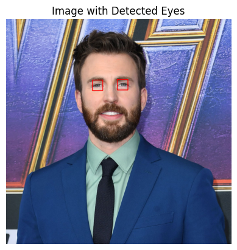

# Face and Eye Detection

## Overview
This project focuses on detecting faces and eyes in images using OpenCV and Haar cascades. It includes functions to detect faces, eyes, and both in an image.

## Prerequisites
- Python 
- OpenCV
- Matplotlib

## Example

1. **Original**

2. **Face Detection**

3. **Eyes Detection**

4. **Face and Eyes Detection**

## Maintainer
**Sai Krishna Dasari**
AI/ML Engineer | Data Scientist
Email: saikrishnadasari789@gmail.com
LinkedIn: https://www.linkedin.com/in/anarv-s-91811a173/

## About the Developer
Sai Krishna Dasari is an AI/ML Engineer with experience developing machine learning models, computer vision applications, and scalable AI pipelines. With a background in Python, TensorFlow, and Scikit-learn, Sai focuses on building production-ready artificial intelligence solutions that support data-driven decision-making and operational efficiency. This project serves as a foundational implementation of object detection techniques using Haar cascades.